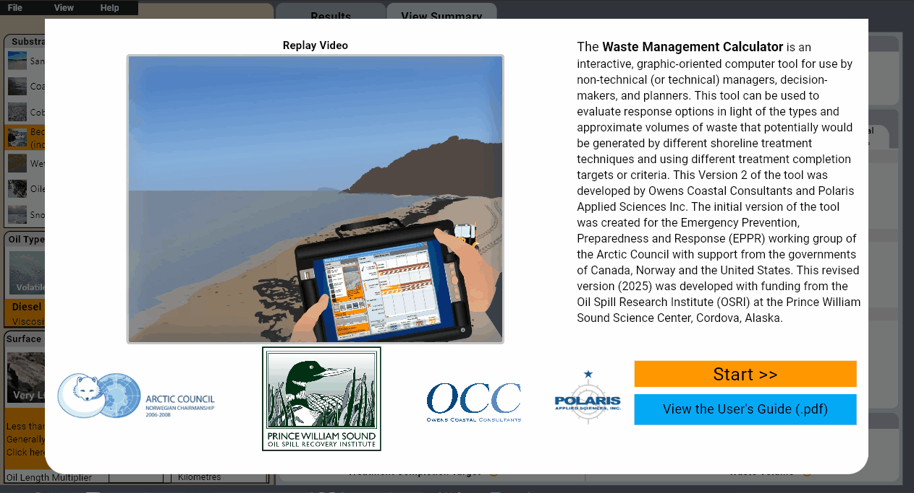

# PetroTact Solutions 🛢️  
A decision-support tool built for Owens Coastal Consultants to assist field teams in identifying optimal petroleum spill cleanup tactics.
  
---

## ⚙️ Features
- Dynamic UI for substrate and treatment goal selection
- Matrix-based logic to determine appropriate cleanup methods
- Visual output of recommended tactics based on user input
- Tactic categories include Preferred, Conditional, and Not Applicable
- Designed for field usability with a focus on clarity and speed

---

## 🧠 Logic
Each combination of substrate and treatment goal maps to a specific set of tactics. The app filters, categorizes, and visually displays these tactics to aid rapid decision-making in field conditions.
## 🛠 Technologies Used
- Python (Flet for UI)
- Custom decision matrix logic
- Dynamic UI layout system
- Responsive design for multiple screen sizes

---

## 🔒 Disclaimer
PetroTact Solutions was developed in collaboration with Owens Coastal Consultants, who retain ownership of the original product and its associated proprietary datasets. This public version has been modified for demonstration purposes. Public use of this code is permitted for educational and portfolio review only and may not be repurposed for commercial applications.
